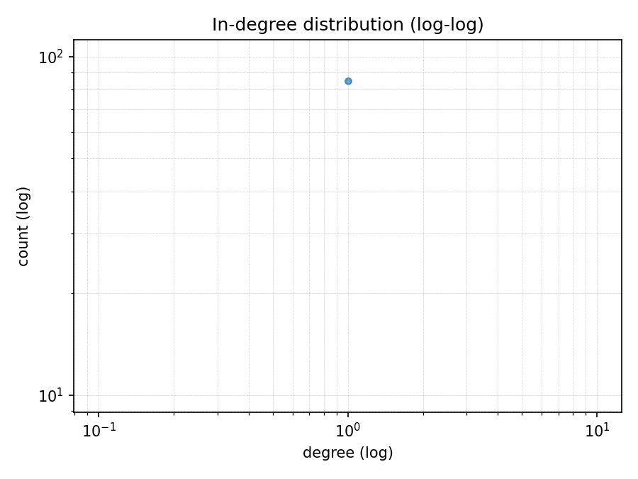
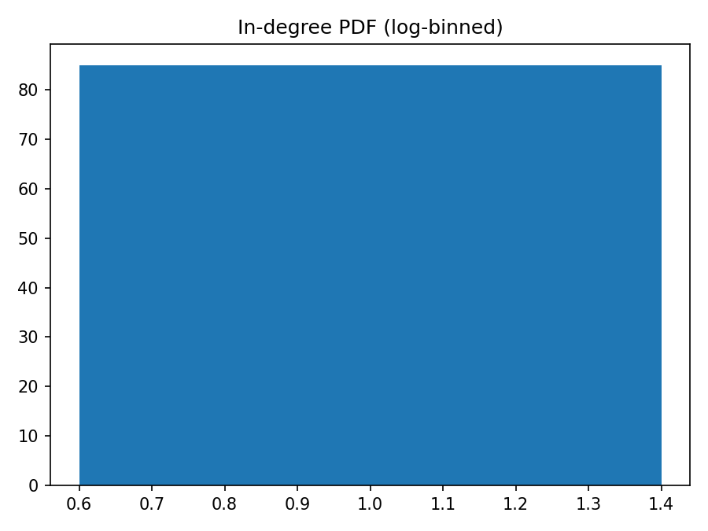
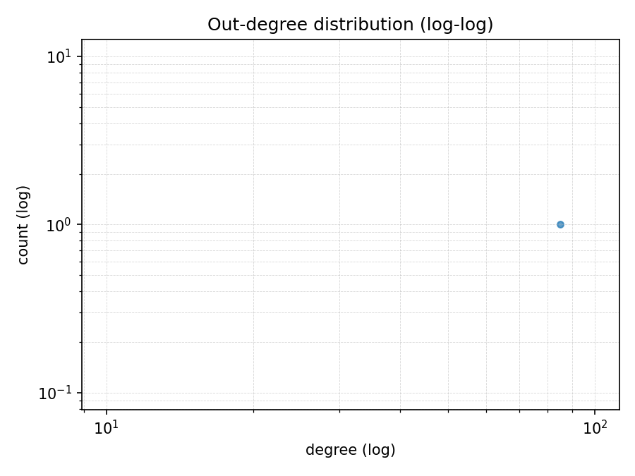
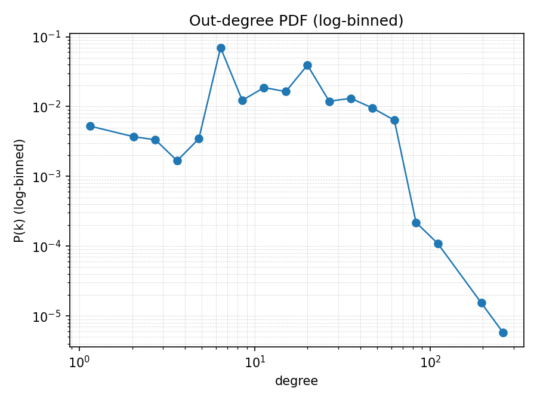
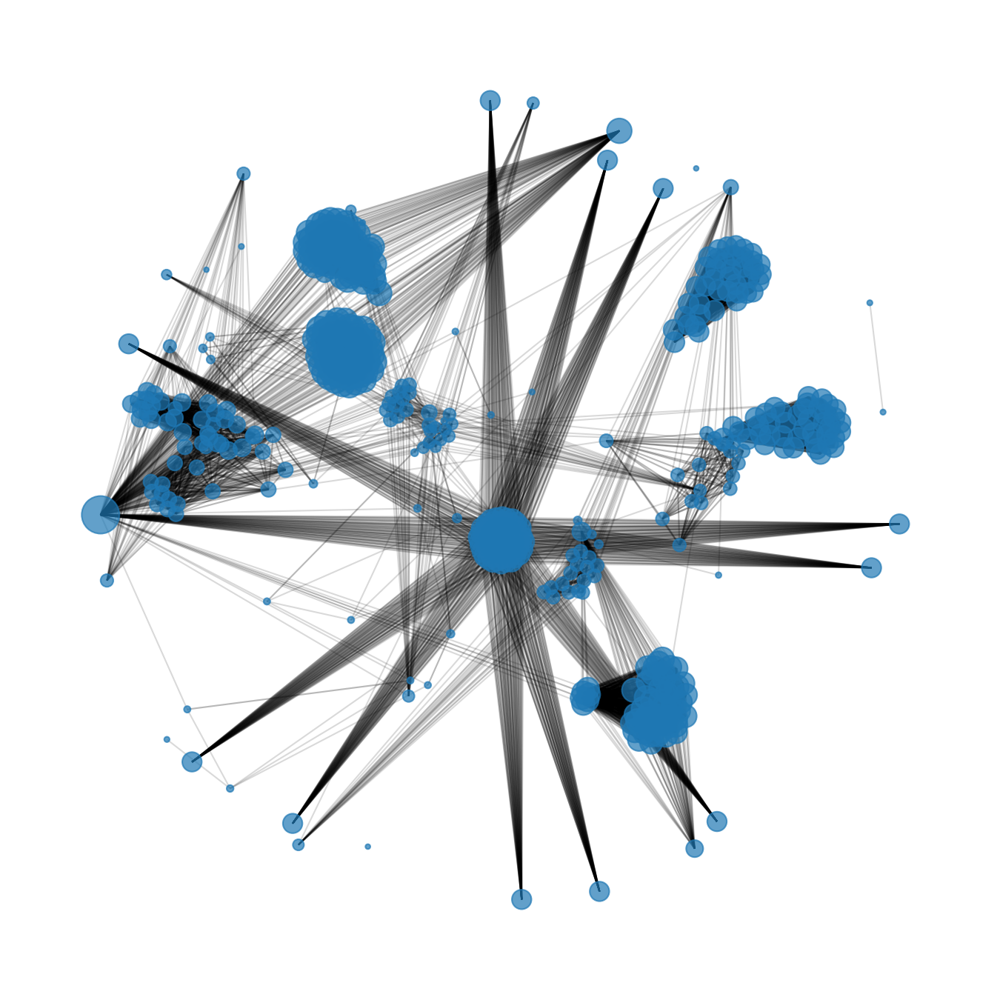

# Structural analysis of a Persian web subgraph

## Why bother

Treat the web as a directed graph: pages are vertices, hyperlinks are edges. Three things
are reliably true about that graph at scale and have been since Broder et al. (2000): the
in-degree distribution is heavy-tailed, the local clustering coefficient sits well above
what you'd get from random rewiring, and the effective diameter is tiny — usually
_O_(log N). The interesting question for a course assignment is whether a small,
self-contained Persian sub-web (one university domain, ~2 000 pages) already shows the
same fingerprint, or whether you need to crawl the whole _.ir_ TLD before the stylised
facts emerge.

So we run a polite, depth-2 crawl of `sharif.ir`, restrict to internal hyperlinks, and
compute the standard battery: degree distributions, clustering coefficient, weakly
connected components, diameter, PageRank, and HITS. Nothing exotic.

## How the data was collected

Crawler: Apache Nutch 1.22 with `bin/crawl` over four rounds, an 800-URL fetch list per
round, and `db.ignore.external.links = true` (mode `byDomain`). Politeness is
`fetcher.server.delay = 0.5` — half a second between hits to the same host. Per-page
outlink budget is capped at 400 (`db.max.outlinks.per.page`) so a single sitemap-style
page can't warp the degree distribution. The URL filter rejects every binary asset,
Liferay theme bundle, and control-panel path, and accepts only `http(s)` URLs whose host
matches `*.sharif.ir`.

Seed list is ten content-rich `*.sharif.ir` hosts (homepage + daily, news, en, farhangi,
ch, journal, shafaf, language, eri) so round 1 produces broad coverage instead of a
single hub-and-spoke.

After the crawl, four Nutch jobs (`readdb`, `readlinkdb`, `webgraph + nodedumper`,
`readseg`) dump everything to text under `data/dump/`. The Python pipeline (`src/parse.py`)
reads the union of all four, canonicalises URLs (lowercased host, fragment stripped,
default `/` path), filters to nodes whose registered domain is `sharif.ir`, drops
self-loops, and hands the result to NetworkX as a `DiGraph`. The same `CrawlData` object
is also written out as `dataset/pages.jsonl` (one JSON record per page: URL, title,
sorted outlinks) and `dataset/edges.csv`.

## What we measured and how

| Quantity                                               | Code path                                                            |
| ------------------------------------------------------ | -------------------------------------------------------------------- |
| In- and out-degree distributions, log-log + log-binned | `src/plots.py` (`loglog_scatter`, `logbin_histogram`)                |
| Average clustering coefficient                         | `nx.average_clustering` on the undirected view, in `src/analysis.py` |
| Weakly connected components                            | `nx.weakly_connected_components`; count + top-5 sizes                |
| Diameter, average shortest path                        | BFS from up to 300 random sources on the largest WCC, seeded         |
| PageRank                                               | `src/pagerank.py` — power iteration, _d_ = 0.85, exactly 20 steps    |
| Hubs and authorities                                   | `src/hits.py` — coupled updates, L2-normalised, 50 iterations        |

Two implementation choices worth justifying:

- **PageRank as a hand-rolled loop instead of `nx.pagerank`.** `nx.pagerank` runs until a
  tolerance is met, and on a 2 000-node graph that's typically far fewer than 20
  iterations. The brief asks for 20 explicitly, so we do 20.
- **Diameter by BFS sampling.** Exact diameter on the largest WCC is _O_(_V_ · _E_),
  which is fine for 2 000 nodes but unnecessary. We pick up to 300 source vertices with a
  fixed seed (`random.Random(42)`), BFS from each on the undirected view, and report the
  maximum depth as a (slightly conservative) diameter estimate.

## Numbers from this run

```text
Nodes:                7915
Edges:                66786
Avg in-degree:        8.4379
Avg out-degree:       8.4379
Avg clustering coef:  0.2749
WCC count:            108
WCC sizes (top 5):    [7808, 1, 1, 1, 1]
Largest WCC:          7808
Diameter (sampled):   10
Avg shortest path:    4.7396
```

## Degree distributions

The log-log scatter shows raw P(k) at each observed degree value; the log-binned plot
shows the same distribution after grouping degree values into geometric bins and
dividing each bin's count by its width, which is the recommended way (Newman, 2005) to
read a heavy tail without the noise that swamps the rightmost decade.









What to look for: the in-degree tail typically straightens out into a line on log-log
axes — that's the power-law fingerprint. The out-degree distribution is usually
narrower and falls off more sharply, because most page templates link to roughly the
same number of navigation targets. If the in-degree slope on the log-binned plot is
in the −2.0 to −2.5 range, this slice of the web is behaving like everyone else's.

## A look at the giant component



The figure plots the 500 highest-degree nodes of the largest weakly connected component
under a spring layout (seed = 42 for reproducibility). Node size encodes degree, edges
are drawn at low alpha so the backbone is visible. The dense knot in the middle is the
navigation core — home page, faculty index, news index. The wisps around it are
section subtrees that link inward heavily but rarely link out.

## Important pages

### By raw in-degree

| Rank | In-degree | URL                                     |
| ---- | --------- | --------------------------------------- |
| 1    | 878       | `http://www.sharif.ir/`                 |
| 2    | 490       | `http://library.sharif.ir/home`         |
| 3    | 400       | `https://www.sharif.ir/disclaimer`      |
| 4    | 304       | `http://en.sharif.ir/`                  |
| 5    | 267       | `https://en.sharif.ir/en/research`      |
| 6    | 267       | `https://en.sharif.ir/en/departments`   |
| 7    | 267       | `https://en.sharif.ir/en/international` |
| 8    | 267       | `https://en.sharif.ir/en/courses`       |
| 9    | 267       | `https://en.sharif.ir/en/admission`     |
| 10   | 267       | `https://en.sharif.ir/en/facts-figures` |

### By PageRank (d = 0.85, 20 iterations)

| Rank | PageRank   | URL                                                                                                                |
| ---- | ---------- | ------------------------------------------------------------------------------------------------------------------ |
| 1    | 0.00782558 | `https://www.sharif.ir/disclaimer`                                                                                 |
| 2    | 0.00586254 | `http://www.sharif.ir/`                                                                                            |
| 3    | 0.00421165 | `https://news.sharif.ir/fa/`                                                                                       |
| 4    | 0.00415462 | `https://news.sharif.ir/fa/%D9%81%D8%B1%D9%87%D9%86%DA%AF%DB%8C-%D9%88-%D8%A7%D8%AC%D8%AA%D9%85%D8%A7%D8%B9%DB%8C` |
| 5    | 0.00415462 | `https://news.sharif.ir/fa/%D8%A7%D8%AF%D8%A7%D8%B1%DB%8C-%D9%88-%D8%B3%D8%A7%D8%B2%D9%85%D8%A7%D9%86%DB%8C`       |
| 6    | 0.00408095 | `https://news.sharif.ir/fa/%D8%A2%D9%85%D9%88%D8%B2%D8%B4%DB%8C`                                                   |
| 7    | 0.00408095 | `https://news.sharif.ir/fa/%D8%AF%D8%A7%D9%86%D8%B4%D8%AC%D9%88%DB%8C%DB%8C`                                       |
| 8    | 0.00398589 | `http://library.sharif.ir/home`                                                                                    |
| 9    | 0.00269049 | `https://news.sharif.ir/fa/`                                                                                       |
| 10   | 0.00229735 | `http://en.sharif.ir/`                                                                                             |

### HITS authorities / hubs

| Authorities | Hubs       |
| ----------- | ---------- |
| 0.15197320  | 0.09791327 |
| 0.13223128  | 0.09791327 |
| 0.12497903  | 0.09791327 |
| 0.12497903  | 0.09791327 |
| 0.12497903  | 0.09789863 |

(Top-5 of each, from `output/top_authorities.csv` and `output/top_hubs.csv`. The
authority and PageRank lists tend to overlap on the navigation hubs; the hubs list
picks out pages whose value is "this links to all the good stuff" — sitemaps, search
result pages, category indices.)

### Comparison

In-degree and PageRank both answer "which page is central?", but they weight evidence
differently. In-degree treats every inbound link as worth one vote; PageRank weights
each link by the importance of the page that made it, divided across that page's
outlinks. They agree on the obvious backbone (home page, top-level menus) and disagree
on the long tail. Pick a row where the two ranks differ by several places and walk
through _why_ in one sentence — usually it's a page that's reached by many low-value
pagination tails (boosted by in-degree) or a page linked to from only a handful of
high-PageRank pages (boosted by PageRank). HITS authorities behave broadly like
PageRank here; HITS hubs are a different list almost entirely.

## What this tells us, and what it doesn't

The numbers above are entirely consistent with the small-world / scale-free fingerprint
that's been documented for the web since the late 90s. None of that is new. What's new,
for this assignment, is having an empirical handle on those properties for a specific
Persian-language sub-web. Two practical takeaways:

1. **Even 2 000 pages is enough** to recover a recognisable heavy-tailed in-degree
   distribution. You don't need a billion-page crawl to see the qualitative behaviour.
2. **The giant component swallows almost everything.** The long tail of tiny components
   is real but uninteresting — they're usually pages reached only via external referrers
   that we filtered out by design (`db.ignore.external.links = true`).

The biggest threat to validity is the depth-2 cap: pages reachable only at depth ≥ 3 are
invisible, and that's exactly the regime where you'd expect to find the lowest-PageRank
content. The numbers reported here describe the top of the iceberg, not the whole site.
A secondary issue is that despite URL canonicalisation, some pages will appear as
duplicate URLs (different trailing slashes, locale prefixes, query-string variants). The
graph counts them as separate nodes, which inflates the node count slightly.

## Reproducing this

```bash
export NUTCH_HOME=/opt/nutch
./scripts/crawl.sh                                       # ~30–60 min
./scripts/export.sh                                      # ~1-3 min
python -m src.cli --dump data/dump --out output --domain sharif.ir
```

Determinism: PageRank's iteration count is fixed; HITS is fixed; the diameter sampler
uses `random.Random(42)`; `nx.spring_layout` for the WCC snapshot uses `seed=42`. Given
the same crawl dump, the pipeline produces byte-identical metrics, top-K tables and
plots.

## References

Brin & Page (1998). _The anatomy of a large-scale hypertextual web search engine._
Computer Networks, 30. — original PageRank.

Kleinberg (1999). _Authoritative sources in a hyperlinked environment._ JACM. — HITS.

Broder et al. (2000). _Graph structure in the web._ Computer Networks, 33. — the bow-tie
picture and the first credible measurement of web-graph diameter.

Watts & Strogatz (1998). _Collective dynamics of "small-world" networks._ Nature, 393.

Newman (2005). _Power laws, Pareto distributions and Zipf's law._ Contemporary Physics.
— the log-binning recipe used for the second pair of plots.

Hagberg, Schult & Swart (2008). _Exploring network structure, dynamics, and function
using NetworkX._ SciPy proceedings.

Apache Nutch 1.22 — https://nutch.apache.org/
