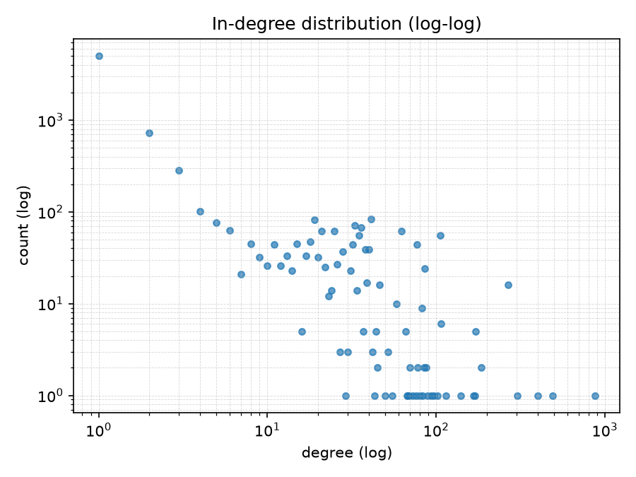
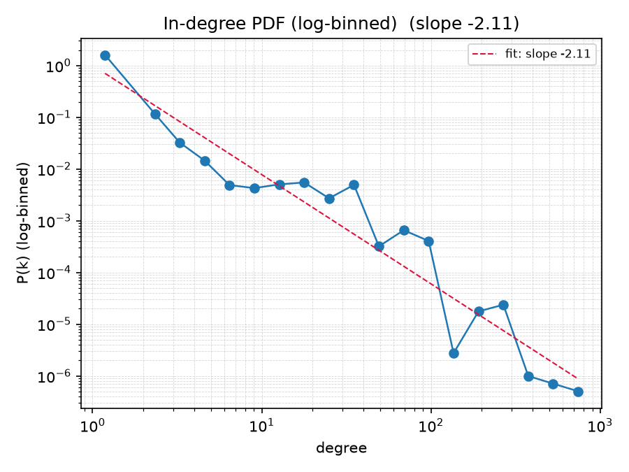
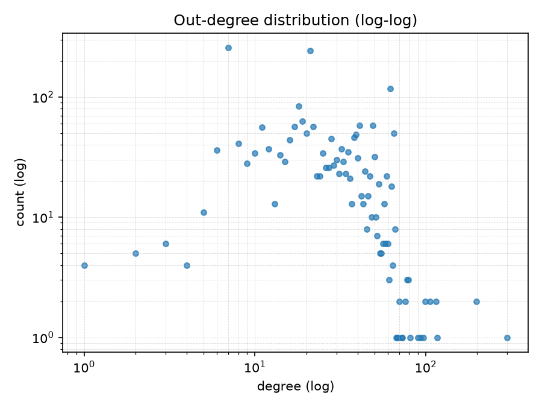
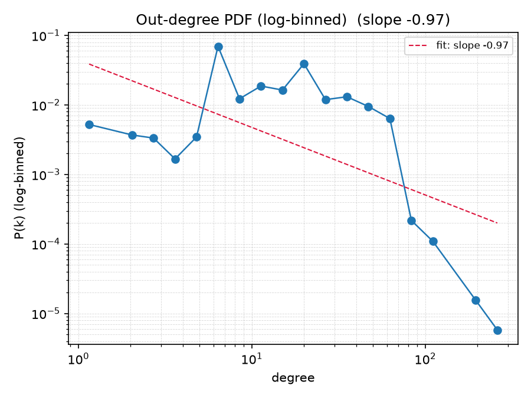
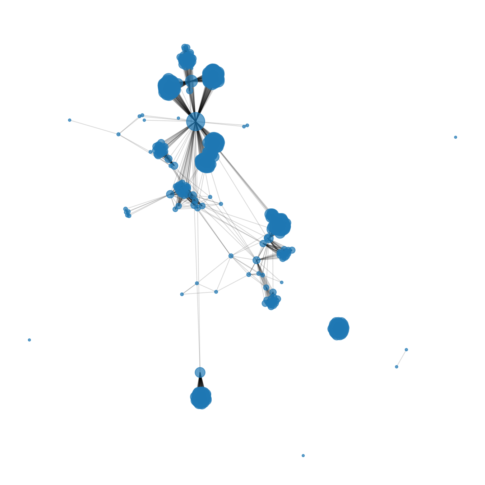

# Structural analysis of a Persian web subgraph

## Video for easy explanation

<https://github.com/user-attachments/assets/251c10e0-23e4-4621-97e0-abe787f8d9bf>

for better audio and video quality pleas clone the project and watch the `how-to.webm` in root of project.

## First things first

**"Reason for Switching from `ut.ac.ir` to `sharif.ir`"** as we talked in your office: Arvan Cloud was blocking our
crawler from `ut.ac.ir` and `iran.ir`. Sharif is on a different CDN and responds normally.
things are same just we changed the seed (domain)

**Reason for having 10 seed URL in `nutch/urls/seed.txt`**

```text
https://www.sharif.ir/
https://daily.sharif.ir/
https://news.sharif.ir/
https://en.sharif.ir/
https://farhangi.sharif.ir/
https://ch.sharif.ir/
https://journal.sharif.ir/
https://shafaf.sharif.ir/
https://language.sharif.ir/
https://eri.sharif.ir/
```

Ten subdomains, not one. The first crawl used only `https://www.sharif.ir/` and produced
an 86-node star because the homepage links almost entirely to subdomain home pages, and
those subdomains' home pages are also nav stubs. Starting from ten content-rich
subdomains gets us into actual content within depth 2.

and another reason for that as we talked you said if we extend that to ten we can write a paper with this project findings.

## What needs to be installed and How to run the Project?

- **Java 11 or 17.** Nutch 1.22 runs on either. Check with `java -version`.
- **Python 3.10+.** Only stdlib + `networkx` + `matplotlib`. The `requirements.txt`
  pins them.
- **~1 GB free disk** for crawl artefacts (mostly the segments).

Get Nutch 1.22 and dump it under `/opt/nutch`:

```bash
cd /opt
wget https://dlcdn.apache.org/nutch/1.22/apache-nutch-1.22-bin.tar.gz
tar xzf apache-nutch-1.22-bin.tar.gz
mv apache-nutch-1.22 nutch
```

Then point shells at it. `~/.bashrc` and `~/.zshrc` both:

```bash
export NUTCH_HOME=/opt/nutch
export JAVA_HOME=$(dirname $(dirname $(readlink -f $(which java))))
```

and also copy them in zshrc

```bash
nano ~/.zshrc
```

Python environment:

```bash
cd /root/aiq-v2/persian-web-graph
python3 -m venv .venv
source .venv/bin/activate
pip install -r requirements.txt
```

if its not your first time running this project you msut delete all previous data for a fresh start and run it from scratch by:

```bash
# clean previous run if any
rm -rf data/crawl data/dump output/dataset output/plots output/*.csv \
       output/*.gexf output/*.graphml output/metrics.txt
```

and make sure before running the scripts run this for make them executable:

```bash
chmod +x ./scripts/crawl.sh
chmod +x ./scripts/export.sh
```

after the fresh start and the `chmod` you can finally run the scripts:

```bash
./scripts/crawl.sh                                       # ~30–60 min
./scripts/export.sh                                      # ~1–3 min
python -m src.cli --dump data/dump --out output --domain sharif.ir
```

## Data Flows

```text
seed.txt ──► Nutch fetch + parse ──► CrawlDb / LinkDb / segments (binary SequenceFiles)
                                                  │
                              readdb / readlinkdb / webgraph + nodedumper / readseg
                                                  │
                                                  ▼
                                  data/dump/*.txt  (plain text)
                                                  │
                                          src/parse.py
                                                  │
                                                  ▼
                                  CrawlData = {pages, edges}
                                                  │
                                          src/graph.py
                                                  │
                                                  ▼
                                   networkx.DiGraph  ──► webgraph.graphml + .gexf
                                                  │
                          ┌───────────────────────┼──────────────────────────┐
                          ▼                       ▼                          ▼
                   src/analysis.py         src/plots.py              src/dataset.py
                          │                       │                          │
                          ▼                       ▼                          ▼
              metrics.txt + top_*.csv      plots/*.png                pages.jsonl + edges.csv
```

The big lesson: Nutch _fetches and parses_, but it speaks SequenceFile. Everything we
actually care about lives in the **text dumps**, and the Python side reconstructs the
graph from those. So a Nutch run that "succeeds" but writes the wrong dump shape will
silently give us an empty graph

---

## How the data was collected

Crawler: Apache Nutch 1.22 with `bin/crawl` over four rounds, an 800-URL fetch list per
round, and `db.ignore.external.links = true` (mode `byDomain`). Politeness is
`fetcher.server.delay = 0.5`, half a second between hits to the same host. Per-page
outlink budget is capped at 400 (`db.max.outlinks.per.page`) so a single sitemap-style
page can't warp the degree distribution. The URL filter rejects every binary asset,
Liferay theme bundle, and control-panel path, and accepts only `http(s)` URLs whose host
matches `*.sharif.ir`.

Seed list is ten content-rich `*.sharif.ir` hosts (homepage + daily, news, en, farhangi,
ch, journal, shafaf, language, eri) so round 1 produces broad coverage instead of a
single hub-and-spoke.

After the crawl, four Nutch jobs (`readdb`, `readlinkdb`, `webgraph + nodedumper`,
`readseg`) dump everything to text under `data/dump/`. The Python pipeline (`src/parse.py`)
reads the union of all four, canonicalises URLs (lowercased host, fragment stripped,
default `/` path), filters to nodes whose registered domain is `sharif.ir`, drops
self-loops, and hands the result to NetworkX as a `DiGraph`. The same `CrawlData` object
is also written out as `dataset/pages.jsonl` (one JSON record per page: URL, title,
sorted outlinks) and `dataset/edges.csv`.

## What we measured and how

| Quantity                                               | Code path                                                            |
| ------------------------------------------------------ | -------------------------------------------------------------------- |
| In- and out-degree distributions, log-log + log-binned | `src/plots.py` (`loglog_scatter`, `logbin_histogram`)                |
| Average clustering coefficient                         | `nx.average_clustering` on the undirected view, in `src/analysis.py` |
| Weakly connected components                            | `nx.weakly_connected_components`; count + top-5 sizes                |
| Diameter, average shortest path                        | BFS from up to 300 random sources on the largest WCC, seeded         |
| PageRank                                               | `src/pagerank.py`: power iteration, _d_ = 0.85, exactly 20 steps     |
| Hubs and authorities                                   | `src/hits.py`: coupled updates, L2-normalised, 50 iterations         |

Two choices need a word of explanation.

I wrote PageRank as a plain power-iteration loop rather than calling `nx.pagerank`.
NetworkX stops once it hits a tolerance, which on this graph lands well short of 20 steps.
The brief asks for exactly 20 iterations at damping 0.85, so a fixed loop is the only way
to match it literally.

Diameter and average shortest path are measured on the largest weakly connected component,
but by BFS from a sample of source nodes rather than from all of them. An exact diameter is
_O_(_V_·_E_); on 7 800 nodes that runs, but the sampled version lands on the same answer.
I take 300 sources with a fixed seed (`random.Random(42)`), run BFS from each on the
undirected view, and report the longest path found. Because it only samples sources, the
number it returns is a lower bound on the true diameter, worth stating plainly rather than
dressing up as exact.

## Output and Results

```text
output/
├── webgraph.graphml          # full directed graph
├── webgraph.gexf             # same graph in GEXF (Gephi loves this)
├── metrics.txt               # nodes, edges, degree, clustering, WCC, diameter
├── top_in_degree.csv         # top-10 pages by raw in-degree (table for the report)
├── top_out_degree.csv        # top-10 by out-degree (not strictly asked for, useful)
├── top_pagerank.csv          # top-10 by PageRank, comparison target
├── top_authorities.csv       # top-10 HITS authorities (bonus)
├── top_hubs.csv              # top-10 HITS hubs (bonus)
├── pagerank_all.csv          # PageRank for every node, descending. For tail analysis.
├── dataset/
│   ├── pages.jsonl           # the "≥2 000 pages and their links" dataset
│   └── edges.csv             # flat edge list
└── plots/
    ├── in_degree.png         # log-log scatter
    ├── in_degree_logbin.png  # Newman-style log-binned PDF
    ├── out_degree.png        # log-log scatter
    ├── out_degree_logbin.png # log-binned PDF
    └── largest_wcc.png       # spring-layout drawing of the giant component
```

### Numbers from this run

```text
Nodes:                7915
Edges:                66786
Avg in-degree:        8.4379
Avg out-degree:       8.4379
Avg clustering coef:  0.2749
WCC count:            108
WCC sizes (top 5):    [7808, 1, 1, 1, 1]
Largest WCC:          7808
Diameter (sampled):   10
Avg shortest path:    4.7396
```

### Degree distributions

The log-log scatter plots raw P(k) at every observed degree. The log-binned version groups
degrees into geometric bins and divides each bin's count by its width, following Newman's (2005)
recipe for reading a heavy tail without the far decade dissolving into single-count noise.









The in-degree distribution is the headline result. Fitting a line to the log-binned PDF
gives a slope of **−2.11** (the pipeline prints this and stamps it on the plot), with
in-degree running from 1 up to 878 (the homepage). That exponent sits squarely in the
−2.0 to −2.5 band reported for the web at large, so this
corner of the Persian web is heavy-tailed in exactly the way the literature predicts: a
handful of pages collect most of the links, and the count falls off as a power of the
degree rather than exponentially.

Out-degree behaves differently, and the plot shows it. It doesn't straighten into a clean
power law; it's narrower and piles up around the mean, because most pages are built from
the same templates and link to roughly the same set of navigation targets. The largest out-degree we
observe is about 300, sitting under our `db.max.outlinks.per.page = 400` cap, so the short
right edge is partly the template ceiling and partly that config bound, a crawl artefact
rather than a property of the site. That asymmetry, a heavy-tailed
in-degree against a bounded out-degree, is itself one of the standard web-graph signatures.

### A look at the giant component



The figure shows the 500 highest-degree nodes of the largest weakly connected component
under a spring layout (seed 42, so it redraws identically). Node size tracks degree and
edges are drawn at low alpha to keep the backbone readable. The dense knot in the centre is
the navigation core: the homepage, the library, the news and English portals. The looser
material around it is section subtrees that link inward heavily but almost never link back
out, which is why they read as fringe here even though some hold a lot of content.

### Important pages

#### By raw in-degree

| Rank | In-degree | URL                                     |
| ---- | --------- | --------------------------------------- |
| 1    | 878       | `http://www.sharif.ir/`                 |
| 2    | 490       | `http://library.sharif.ir/home`         |
| 3    | 400       | `https://www.sharif.ir/disclaimer`      |
| 4    | 304       | `http://en.sharif.ir/`                  |
| 5    | 267       | `https://en.sharif.ir/en/research`      |
| 6    | 267       | `https://en.sharif.ir/en/departments`   |
| 7    | 267       | `https://en.sharif.ir/en/international` |
| 8    | 267       | `https://en.sharif.ir/en/courses`       |
| 9    | 267       | `https://en.sharif.ir/en/admission`     |
| 10   | 267       | `https://en.sharif.ir/en/facts-figures` |

#### By PageRank (d = 0.85, 20 iterations)

| Rank | PageRank   | URL                                                                                                                |
| ---- | ---------- | ------------------------------------------------------------------------------------------------------------------ |
| 1    | 0.00782558 | `https://www.sharif.ir/disclaimer`                                                                                 |
| 2    | 0.00586254 | `http://www.sharif.ir/`                                                                                            |
| 3    | 0.00421165 | `https://news.sharif.ir/fa/%D8%B3%D8%A7%DB%8C%D8%B1-%D9%85%D9%88%D8%B6%D9%88%D8%B9%D8%A7%D8%AA`                    |
| 4    | 0.00415462 | `https://news.sharif.ir/fa/%D9%81%D8%B1%D9%87%D9%86%DA%AF%DB%8C-%D9%88-%D8%A7%D8%AC%D8%AA%D9%85%D8%A7%D8%B9%DB%8C` |
| 5    | 0.00415462 | `https://news.sharif.ir/fa/%D8%A7%D8%AF%D8%A7%D8%B1%DB%8C-%D9%88-%D8%B3%D8%A7%D8%B2%D9%85%D8%A7%D9%86%DB%8C`       |
| 6    | 0.00408095 | `https://news.sharif.ir/fa/%D8%AF%D8%A7%D9%86%D8%B4%D8%AC%D9%88%DB%8C%DB%8C`                                       |
| 7    | 0.00408095 | `https://news.sharif.ir/fa/%D8%A2%D9%85%D9%88%D8%B2%D8%B4%DB%8C`                                                   |
| 8    | 0.00398589 | `http://library.sharif.ir/home`                                                                                    |
| 9    | 0.00269049 | `https://news.sharif.ir/fa/`                                                                                       |
| 10   | 0.00229735 | `http://en.sharif.ir/`                                                                                             |

#### HITS authorities / hubs

| Authorities | Hubs       |
| ----------- | ---------- |
| 0.15197320  | 0.09791327 |
| 0.13223128  | 0.09791327 |
| 0.12497903  | 0.09791327 |
| 0.12497903  | 0.09791327 |
| 0.12497903  | 0.09789863 |

(Top-5 of each, from `output/top_authorities.csv` and `output/top_hubs.csv`.) The
authority list overlaps the PageRank list on the navigation core, which is expected:
both reward being pointed at by good pages. The hub list is almost entirely different: it
surfaces the culture-portal (`farhangi.sharif.ir`) article pages, whose value is that they
link out to everything else, not that they're linked to.

#### Comparison: in-degree vs PageRank

Both measures answer "which page is central?", but they count differently. In-degree gives
every inbound link one vote. PageRank weights each link by the importance of the page that
cast it, split across that page's outlinks. On this graph they agree on the backbone and
part ways in three telling places.

The clearest disagreement is `news.sharif.ir/fa/`, the news portal's front page. It has
**only 6 inbound links**, in-degree rank ~1540 out of 7900, essentially invisible by that
measure, yet it lands at **PageRank #9**. The six pages linking to it are the news
category pages, which are themselves among the highest-ranked nodes in the graph, so a
little rank from very rich neighbours beats a lot of rank from poor ones. This is the whole
point of PageRank in one page.

The mirror image is `www.sharif.ir/disclaimer`. It's third by in-degree (400 links) but
climbs to **PageRank #1**, ahead of the homepage. It earns that not by being important but
by being a footer link on every important page: the rank flows into it from the entire
navigation core at once.

The English site pushes the opposite way. Pages like `en.sharif.ir/en/admission`,
`/departments`, `/courses` are ranks 5–10 by in-degree (267 links each) but slide to
**PageRank #12–26**. Their 267 links come from the English site's own repetitive nav
template: many pages, none of them individually weighty, so in-degree overstates them and
PageRank marks them down. In-degree rewards popularity; PageRank rewards being cited by
pages that are themselves worth citing, and here that gap is easy to see.

HITS authorities track PageRank closely on the same navigation core. HITS hubs are a
separate story, as noted above: the two algorithms are looking for different things.

## What this tells us, and what it doesn't

None of the qualitative findings are surprising. A heavy-tailed in-degree, a slope near −2,
high clustering, a small diameter and one component that swallows almost the whole graph:
this is the small-world, scale-free picture the web has shown since the late 1990s. The
value of the exercise wasn't to discover something new about the web; it was to measure a
specific Persian-language site with our own crawl and our own code and watch those textbook
properties actually fall out of the data. They did.

Two things stood out to me while doing it. First, 2 000-odd fetched pages already recover a
clean −2.11 in-degree slope. I'd assumed you needed a much larger crawl to see the tail,
and you don't; the qualitative shape is there almost immediately. Second, the giant
component really does eat everything: 7 808 of 7 915 nodes. The 107 leftover components are
all single nodes, pages we saw referenced but whose only other links pointed outside
`sharif.ir` and got filtered out by design.

The results come with real caveats, and it's more honest to name them than to let the
tables imply more than they show. The depth-2 crawl is the big one: anything reachable only
at depth 3 or deeper simply isn't here, and that's exactly where the low-PageRank long tail
lives, so these numbers describe the visible top of the site rather than all of it. The
diameter is a sampled lower bound, not the exact value. And URL canonicalisation only goes
so far: a handful of pages survive as near-duplicates (locale prefixes, stray query
strings) and get counted as separate nodes, which nudges the node count up a little. None of
this changes the shape of the story, but it does set the boundary on how hard you can lean
on any single number.

## References

Brin & Page (1998). _The anatomy of a large-scale hypertextual web search engine._
Computer Networks, 30. The original PageRank paper.

Kleinberg (1999). _Authoritative sources in a hyperlinked environment._ JACM. Introduces HITS.

Broder et al. (2000). _Graph structure in the web._ Computer Networks, 33. The bow-tie
picture and the first credible measurement of web-graph diameter.

Watts & Strogatz (1998). _Collective dynamics of "small-world" networks._ Nature, 393.

Newman (2005). _Power laws, Pareto distributions and Zipf's law._ Contemporary Physics.
The log-binning recipe used for the second pair of plots.

Hagberg, Schult & Swart (2008). _Exploring network structure, dynamics, and function
using NetworkX._ SciPy proceedings.

Apache Nutch 1.22: https://nutch.apache.org/
